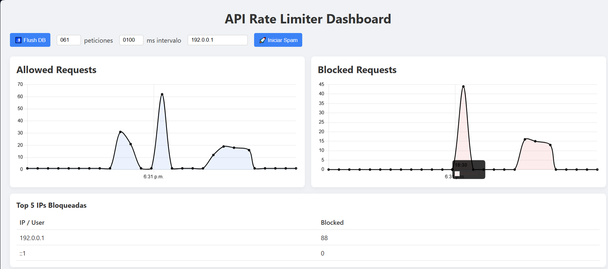

# API Rate Limiter Dashboard

Demo completo de un servicio de rate‑limiting distribuido con Redis + Lua y un dashboard en React/Vite que muestra en tiempo real:

- Gráficas de peticiones “Allowed” y “Blocked” por intervalo  
- Tabla con Top 5 IPs/usuarios bloqueados  
- Controles para “Flush DB” y para generar carga (spam) simulando distintas IPs/usuarios  

---

## 📁 Estructura

API-rate-limit-dashboard/  
├── api/                     
│   ├── lua/token_bucket.lua  
│   ├── src/  
│   │   ├── config.js       
│   │   ├── limiter.js      
│   │   ├── redis.js        
│   │   └── server.js       
│   └── package.json        
├── dashboard/               
│   ├── src/  
│   │   ├── components/  
│   │   │   ├── Controls.jsx  
│   │   │   ├── StatsCharts.jsx  
│   │   │   └── TopBlocked.jsx  
│   │   ├── services/api.js  
│   │   ├── App.jsx          
│   │   ├── main.jsx         
│   │   └── index.css        
│   └── package.json        
└── README.md                # <- Este fichero

---

## 🚀 Instalación y arranque

### Prerrequisitos

- Docker (para Redis) o Redis instalado  
- Node.js (v14+) y npm

### 1. Levantar Redis

docker run -d --name redis -p 6379:6379 redis:latest

### 2. Iniciar el API Rate Limiter

cd api  
npm install  
npm start  
# -> http://localhost:4000

### 3. Iniciar el Dashboard

cd dashboard  
npm install  
npm run dev  
# -> http://localhost:5173

---

## ⚙️ Detalles del API

- Lua Token Bucket atómico en api/lua/token_bucket.lua  
- Middleware Express para rate‑limit por IP o X-User-ID  
- Endpoints:  
  - GET /ping → 200 o 429  
  - GET /stats → { total_requests, blocked_requests, buckets }  
  - POST /config → { refillTokens, refillPeriod }  
  - POST /admin/flush → vacía Redis  

- CORS habilitado para http://localhost:5173

---

## 🎨 Detalles del Dashboard

- React + Vite  
- Chart.js con adaptador date-fns  
- Componentes:  
  - StatsCharts.jsx: dos gráficas independientes  
  - TopBlocked.jsx: tabla Top 5 bloqueados  
  - Controls.jsx: flush DB y spam con X-User-ID  

- Polling cada 2 s, calcula deltas por intervalo, histórico de 60 muestras
